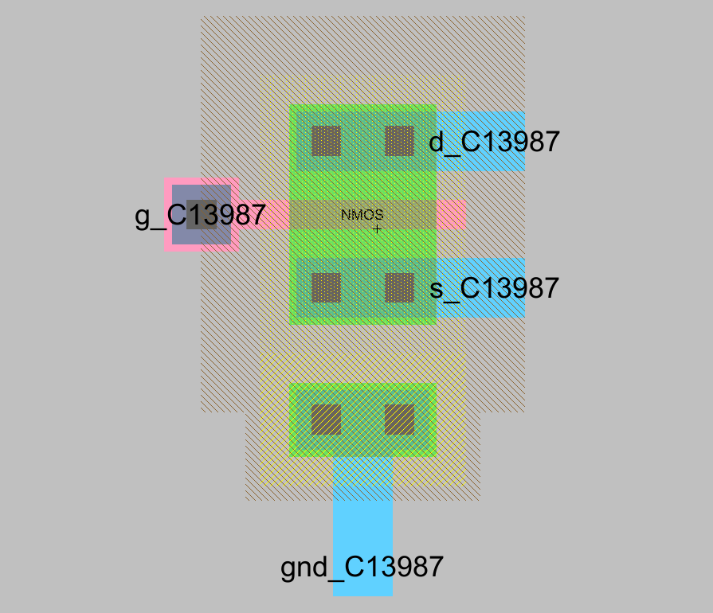
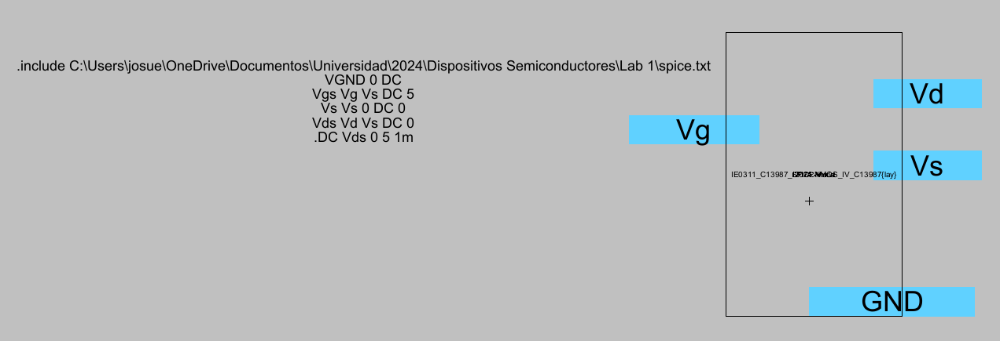
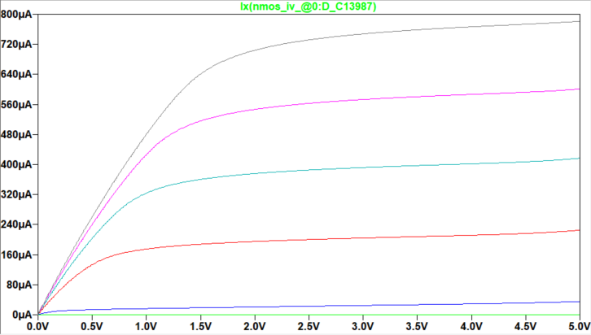
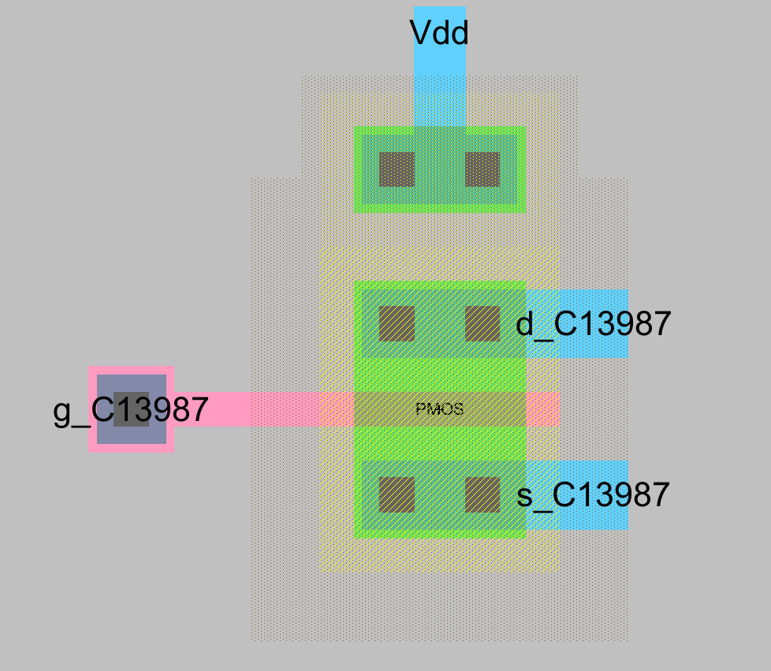
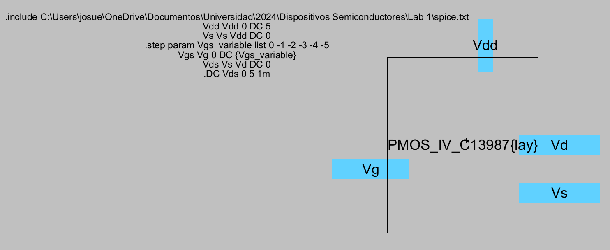
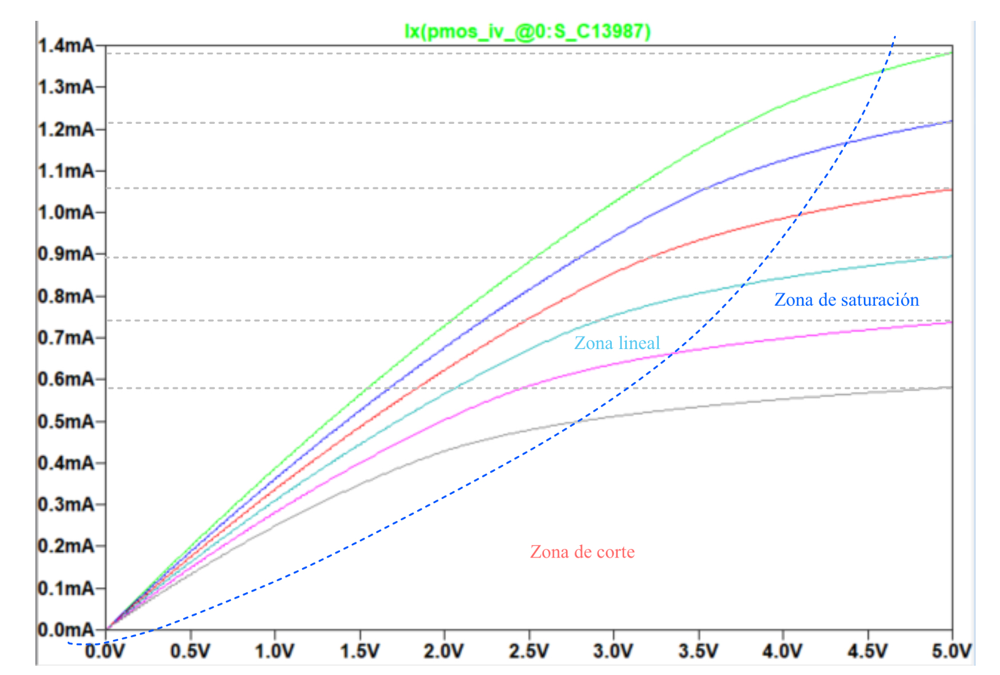

# MOSFET Characterization Lab

## Overview

This repository contains the materials and results for **Laboratory 1: MOSFET Curves**, developed as part of the course *IE03110 – Semiconductor Devices* at the University of Costa Rica .

The objective of this lab is to analyze the electrical behavior of **NMOS and PMOS transistors**, including their layout design, SPICE-based simulation, and the characterization of their current-voltage (Ids vs Vds) curves across different regions of operation.

---

## Contents

The project is organized as follows:

* **NMOS Transistor**

  * Layout design
  * Simulation cell and SPICE code
  * Ids vs Vds characteristic curves and operating regions

* **PMOS Transistor**

  * Layout design
  * Simulation cell and SPICE code
  * Ids vs Vds characteristic curves and operating regions 

---

## Tools and Software Used

The following tools were used to complete this laboratory:

* **Electric VLSI Design System** (for NMOS and PMOS transistor layouts)
* **SPICE Simulator** (for circuit simulation and curve generation)

> All corresponding files, including layouts, simulation setups, SPICE code, and generated results, are attached in this repository.

---

## Description of Work

### 1. NMOS Transistor

#### Layout

*Figure: NMOS transistor layout with connections.*

#### Simulation Cell and SPICE Code

*Figure: Simulation setup and SPICE code used for NMOS.*

#### Ids vs Vds Curves

*Figure: Ids vs Vds curves showing different operating regions.*

---

### 2. PMOS Transistor

#### Layout

*Figure: PMOS transistor layout with connections.*

#### Simulation Cell and SPICE Code

*Figure: Simulation setup and SPICE code used for PMOS.*

#### Ids vs Vds Curves

*Figure: Ids vs Vds curves showing different operating regions.*

---

## Results

* Successful generation of Ids vs Vds curves for both NMOS and PMOS transistors.
* Clear identification of transistor operating regions:

  * Cutoff region
  * Linear (triode) region
  * Saturation region
* Validation of expected MOSFET behavior through simulation.

## Author

**Josué María Jiménez Ramírez**
Student – Electrical Engineering
University of Costa Rica 
